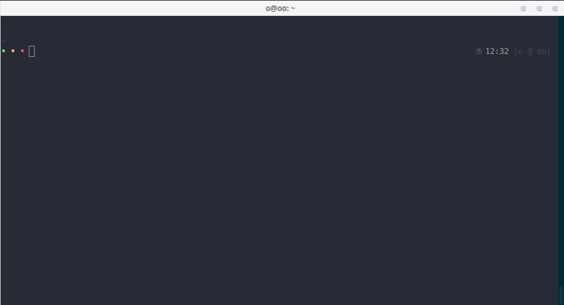
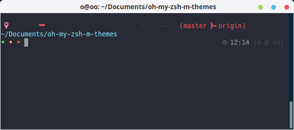
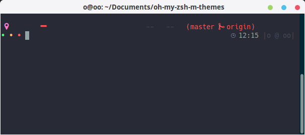
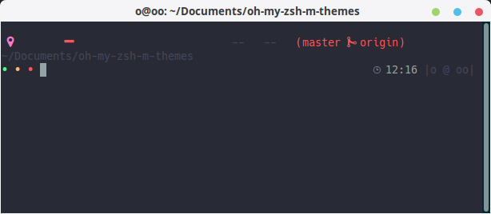
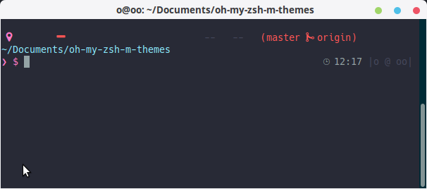
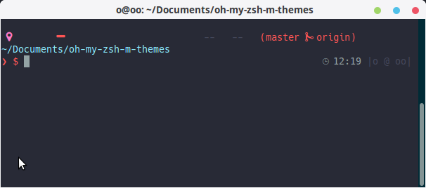
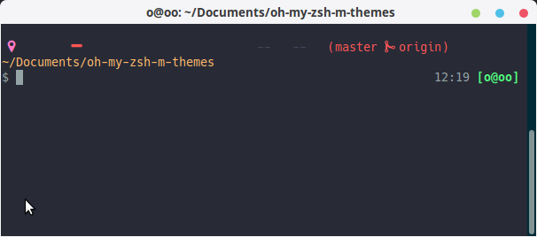

Oh My Zsh M Themes
==================

A collection of zsh themes for your prompt.



## Prerequisites

- [zsh](http://www.zsh.org/)
- [oh-my-zsh](https://github.com/robbyrussell/oh-my-zsh)
- [oh-my-git](https://github.com/arialdomartini/oh-my-git)
- [Antigen](https://github.com/zsh-users/antigen)
- [Gogh](https://github.com/Mayccoll/Gogh) (Color Scheme)

## Install With antigen:

Edit de file ```.zshrc``` and add this line:

location:
> ~/.zshrc

```bash
    antigen theme Mayccoll/oh-my-git-themes liino
```

One line command to add the line

```bash
    $ echo "antigen theme Mayccoll/oh-my-git-themes liino" >> ~/.zshrc
```


## All in one install

This script will intall **zsh**, **Oh-My-Zsh**, **Antigen** all at ones.

```bash
    $ wget -O xt  http://git.io/UBJMHQ && chmod +x xt && ./xt && rm xt
```

## Themes

- libra
- libra_clean
- libra_dark
- liino
- liino_red
- remol

## Update

```bash
    $ cd ~/.antigen/repos/https-COLON--SLASH--SLASH-github.com-SLASH-Mayccoll-SLASH-oh-my-git-themes.git
    $ git pull
```

## Color Scheme

- [Gogh](https://github.com/Mayccoll/Gogh) (Color Scheme)

## ScreenShots

#### libra


#### libra_clean


#### libra_dark


#### liino


#### liino_red


#### remol



---------------------------

## Credits

- **zsh**
http://www.zsh.org/

- **oh-my-zsh**
https://github.com/robbyrussell/oh-my-zsh

- **oh-my-git**
https://github.com/arialdomartini/oh-my-git

- **Antigen**
https://github.com/zsh-users/antigen
